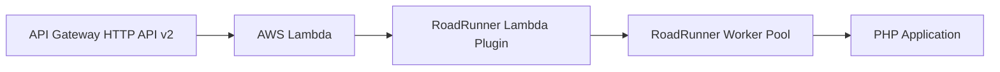

# RoadRunner AWS Lambda

RoadRunner AWS Lambda plugin + demo stack showing how to proxy API Gateway (HTTP API v2) events into PHP using RoadRunner workers.

## Overview

- Minimal Lambda bootstrap that runs RoadRunner and forwards requests through the `lambda` plugin.
- Includes a sample Symfony app to validate HTML responses, urlencoded forms, multipart uploads, and assorted content types.
- Custom Docker image built from this repo (no patched AWS base images) for predictable PHP support.

### Request Flow



## Contents

- `plugin.go` – Lambda handler that converts API Gateway requests to RoadRunner HTTP proto payloads.
- `request_parser.go` – Mirrors RoadRunner HTTP parsing for urlencoded/multipart bodies and uploads.
- `Dockerfile` – Builds a self-contained image with PHP, RoadRunner, and this plugin without AWS base image hacks.

## Docker Image

We build a bespoke container instead of AWS-provided base images to avoid manual PHP patching:

- Based on a standard lambda base (`al2023`) with PHP, RoadRunner binary, and plugin artifacts baked in.
- Suitable for local testing (e.g., with LocalStack) and deployment to AWS Lambda container images.

To build locally:

```bash
docker build -t rr-aws-lambda .
```

## Local Build (Go)

Compile the Lambda binary and vendor assets:

```bash
go mod download
go build -o bin/lambda-bootstrap .
```

## Testing (Go)

Unit tests cover Lambda handler request translation, body parsing (including base64), and multipart/urlencoded handling parity with RoadRunner HTTP parser:

```bash
GOCACHE=$(pwd)/.cache/go-build go test ./...
```

## License

MIT
